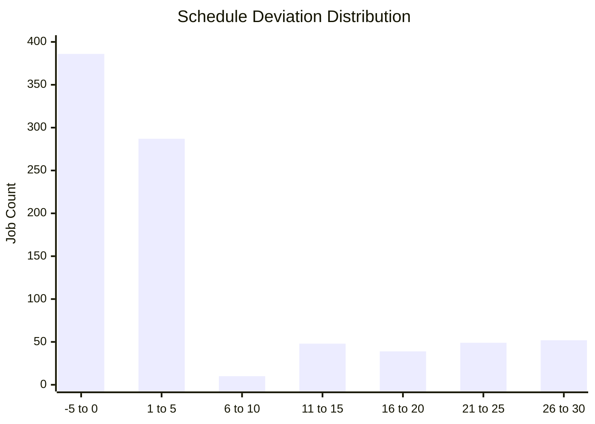
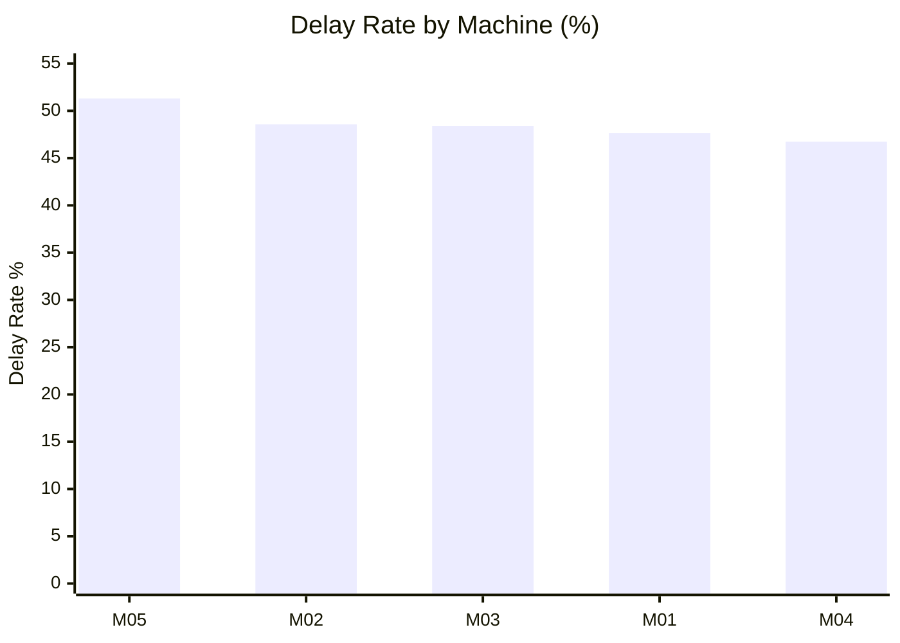
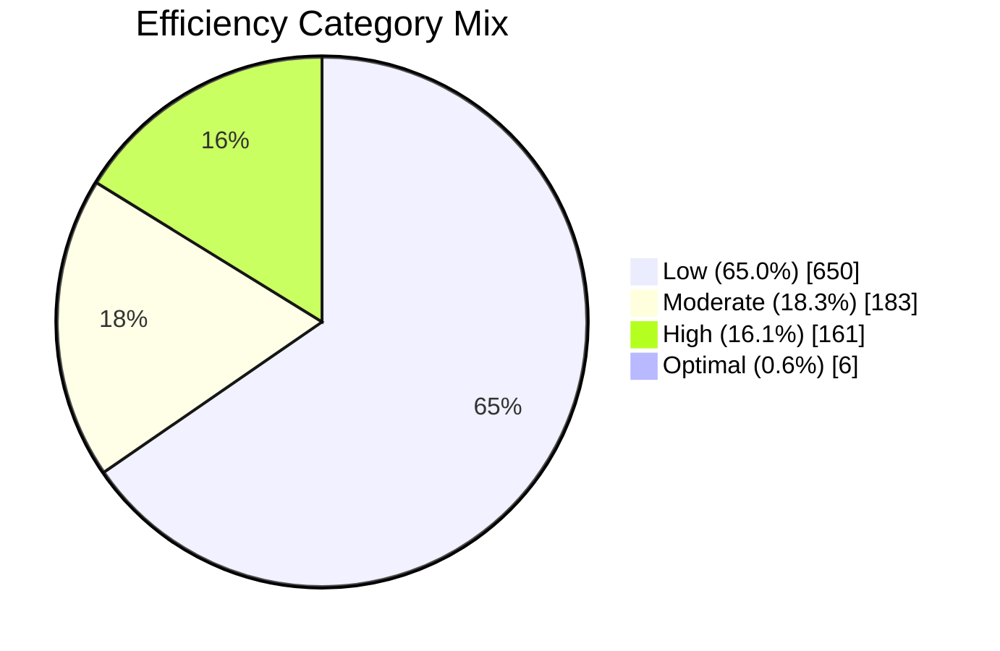

# Production Schedule Risk and Efficiency Report
Business-facing decision support for improving schedule reliability, throughput stability, and operational efficiency.

## What This Report Delivers
This report identifies where production performance is most at risk, what conditions are driving delays and low efficiency, and which interventions should be prioritized first.
Drivers were identified through structured feature analysis and predictive classification modeling.

It is designed for plant leaders, operations managers, and production planners.

## Executive Highlights
From the current production dataset (`1,000` jobs):

- Nearly **1 in 2 jobs (48.5%)** shows operational delay signal behavior (timing slip and/or delayed status).
- **22.73%** are formally labeled `Delayed` (within Completed vs Delayed jobs).
- **Machine M05** is the highest-risk asset for delay instability.
- **Grinding and Milling** show the strongest instability patterns across schedule behavior.
- Several machine-operation combinations exhibit elevated variability, increasing planning uncertainty.
- Efficiency distribution is materially skewed toward the **Low** category (**65.0%**), indicating significant productivity headroom.

## Why This Matters to the Business
Operational instability directly impacts:

- On-time delivery performance
- Overtime and labor pressure
- Schedule confidence for planning teams
- Capacity utilization and throughput consistency
- Unit economics through rework, waiting, and energy waste

This analysis moves from raw job logs to concrete decisions on where to intervene first.

## Key Business Findings
### 1) Delay Exposure Is Material
- Operational delay signal behavior: **48.5%** (jobs with timing slip and/or delayed status).
- Formal labeled delay rate: **22.73%** (jobs explicitly marked `Delayed` within Completed vs Delayed scope).

Schedule Deviation Distribution (minutes, Actual End vs Scheduled End):

Volatility signal: mean deviation is **4.47 min** with a long right tail (**P90 = 22 min**, **P95 = 26 min**), confirming material operational instability.

Implication:
- Delays are not isolated events; they are a recurring operational pattern that requires targeted control points.

### 2) Risk Is Concentrated, Not Uniform
- **M05** has the highest composite risk profile.
- Example operational signal: under low availability conditions, one high-risk machine context showed **double-digit lift in delay probability**.

Delay Rate by Machine (risk concentration):

Implication:
- Asset-level interventions will outperform broad, one-size-fits-all process changes.

### 3) Certain Operation Types Are Structurally Less Stable
- **Grinding** and **Milling** rank as most unstable in composite benchmarking.
- Schedule deviation behavior varies materially by operation type.

Implication:
- Standard work and schedule buffers should be operation-specific, not generic.

### 4) High-Variance Segments Create Planning Volatility
- Machine x operation segments show large variation in delay behavior.
- High-variance segments should be treated as operational watchlists.

Machine x Operation Variability Heatmap (segment intensity):

Legend: `HIGH` = highest variability tier, `MED` = moderate, `LOW` = lower.

| Machine | Additive | Drilling | Grinding | Lathe | Milling |
|---|---|---|---|---|---|
| M01 | LOW | LOW | LOW | HIGH | MED |
| M02 | MED | HIGH | HIGH | MED | LOW |
| M03 | MED | LOW | HIGH | LOW | MED |
| M04 | LOW | HIGH | HIGH | HIGH | HIGH |
| M05 | MED | MED | MED | LOW | HIGH |

Highest-variance hotspots include: `M05 x Milling`, `M03 x Grinding`, `M04 x Lathe`, and `M04 x Grinding`.

Implication:
- Segment-level governance (not just machine-level) is needed for reliable weekly planning.

### 5) Efficiency Opportunity Is Large
- Efficiency mix is heavily weighted to **Low Efficiency (65.0%)**.
- Conditions associated with low efficiency are now explicitly flagged for intervention planning.

Efficiency Mix (share of jobs):

Implication:
- There is substantial upside in throughput and cost performance from focused efficiency programs.

## Recommended Actions (Prioritized)
### Immediate (0-30 Days)
1. Launch a focused reliability sprint on **M05** (availability discipline, maintenance adherence, queue control).
2. Implement operational controls for **Grinding** and **Milling** (start-time governance, handoff timing, exception escalation).
3. Create a weekly risk review on top high-variance machine-operation segments.

### Near-Term (30-90 Days)
1. Introduce risk-based dispatching rules that favor stable segments for critical orders.
2. Add supervisor-facing threshold alerts for delay-prone conditions.
3. Track low-efficiency condition flags as a formal KPI with ownership by line/area leaders.

### Quarter Plan (90+ Days)
1. Institutionalize machine-operation risk scorecards in S&OP / production review cadence.
2. Expand data capture (shift, team, order complexity) to sharpen root-cause precision.
3. Tie interventions to measurable targets: delay reduction, schedule adherence, efficiency mix improvement.

## Success Metrics for Leadership Tracking
- Delay rate reduction (overall and by high-risk machine)
- Schedule deviation reduction (P90/P95)
- Share of jobs in low-efficiency category
- Stability improvement in top high-variance segments
- On-time completion improvement for priority orders

## Decision Support Assets Produced
The analysis produced practical decision-support outputs that can be operationalized:

- Machine risk ranking
- Operation instability ranking
- High-variance process segment list
- Low-efficiency condition flags
- Plain-language insight statements for leadership updates

## Data Source
Hybrid Manufacturing Systems dataset sourced from Kaggle.
Used for structured schedule, machine, and efficiency analysis.

Kaggle dataset: [Hybrid Manufacturing Production Data – Ziya07](https://www.kaggle.com/datasets/ziya07/manufacturing-production-data/code)

## Development Notes
Analytical workflow and modeling supported by modern AI-assisted development tools.

## Bottom Line
This initiative is not just a modeling exercise. It provides a targeted operating plan for reducing delay risk and improving efficiency where the business impact is highest.
